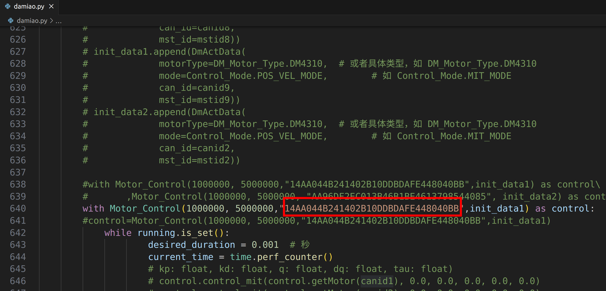

# 使用USB转CANFD驱动达妙电机，python例程

## 介绍
这是适配达妙CANFD新固件的达妙电机python控制例程。

硬件设备需要达妙的**单路/双路 USB转CANFD设备，** **电机波特率设置为5M**。

程序测试环境是**Windows**和**Ubuntu22.04** **Python3.13** ,**强烈建议使用conda环境**,以下均使用Miniconda3，不提供conda安装流程，需自行安装，创建并激活conda环境后，安装python 3.13版本。

程序默认运行的效果是用先让canid为0x01、mstid为0x11的DM4310电机控制模式设置为MIT模式，使能，然后旋转。

**注意：5M波特率下，电机有多个时，需要在末端电机接一个120欧的电阻**

## 软件架构
Miniconda3 + Python3.13

## 安装和编译

打开终端，创建并激活conda环境后，安装python版本的usb库和dmcan-sdk库，输入：
```shell
pip3 install pyusb dmcan-sdk
```

需要安装libusb库的1.0.29版本，进入conda环境后输入：
```shell
conda install -c conda-forge libusb
```

### 创建工作空间
完成环境配置后，创建自己的工作空间，输入：
```shell
mkdir -p ~/catkin_ws
cd ~/catkin_ws
```
然后把gitee上的**u2canfd**文件夹放到catkin_ws目录下。

**注意：arm架构的Linux系统，需要到 https://gitee.com/kit-miao/dm-tools/tree/master/DM_DeviceSDK/C&C++/lib/v1.1.0/linux/arm64 下载驱动.so文件，替换dlls目录下的.so文件**
**libusb-1.0.dll是windows的usb库文件，需要和py执行文件在同一个目录下**

## 简单使用
首先用最新上位机给电机设置5M波特率。

然后给**USB转CANFD设备**设置权限，在终端输入：

***注意：windows系统不需要设置权限***

```shell
sudo nano /etc/udev/rules.d/99-usb.rules
```
然后写入内容：
```shell
SUBSYSTEM=="usb", ATTR{idVendor}=="34b7", ATTR{idProduct}=="6877", MODE="0666"
SUBSYSTEM=="usb", ATTR{idVendor}=="34b7", ATTR{idProduct}=="6632", MODE="0666"
```
然后重新加载并触发：
```shell
sudo udevadm control --reload-rules
sudo udevadm trigger
```
**注意：这个设置权限只需要设置1次就行，重新打开电脑、插拔设备都不需要重新设置**

然后需要通过运行dev\_sn.py文件找到**USB转CANFD设备**的Serial_Number:
```shell
cd ~/catkin_ws/u2canfd
python3 dev_sn.py
```
SN后面的一串字符就是该设备的的Serial_Number

接着复制该Serial_Number，打开damiao.py，替换程序里的Serial_Number,如下图所示：



然后打开终端运行damiao.py文件:
```shell
cd ~/catkin_ws/u2canfd
python3 damiao.py
```
此时你会发现电机亮绿灯，并且旋转

## 进阶使用
下面手把手教你怎么使用这个程序，实现功能是使用5M波特率，1kHz同时控制9个DM4310电机，最后还有双路CANFD的使用简介。

**注意：在windows或者mac系统上控制多个电机时。最好开启多个发送线程分别调用发送电机控制命令函数**

## **注意：5M波特率下，电机有多个时，需要在末端电机接一个120欧的电阻**

1. 首先用最新上位机给每个电机设置5M波特率。

2. 然后在main函数里定义id变量：
```shell
canid1=0x01
mstid1=0x11
canid2=0x02
mstid2=0x12
canid3=0x03
mstid3=0x13
canid4=0x04
mstid4=0x14
canid5=0x05
mstid5=0x15
canid6=0x06
mstid6=0x16
canid7=0x07
mstid7=0x17
canid8=0x08
mstid8=0x18
canid9=0x09
mstid9=0x19
```
3. 然后定义一个电机信息列表：
```shell
init_data1= []
```
4. 然后再用9个电机数据对该容器进行填充：
```shell
init_data1.append(DmActData(
                    motorType=DM_Motor_Type.DM4310,  
                    mode=Control_Mode.MIT_MODE,      
                    can_id=canid6,
                    mst_id=mstid6))
        init_data1.append(DmActData(
                    motorType=DM_Motor_Type.DM4310,  
                    mode=Control_Mode.MIT_MODE,       
                    can_id=canid2,
                    mst_id=mstid2))
        init_data1.append(DmActData(
                    motorType=DM_Motor_Type.DM4310, 
                    mode=Control_Mode.MIT_MODE,      
                    can_id=canid3,
                    mst_id=mstid3))
        init_data1.append(DmActData(
                    motorType=DM_Motor_Type.DM4340, 
                    mode=Control_Mode.MIT_MODE,        
                    can_id=canid4,
                    mst_id=mstid4))
        init_data1.append(DmActData(
                    motorType=DM_Motor_Type.DM4340, 
                    mode=Control_Mode.MIT_MODE,       
                    can_id=canid5,
                    mst_id=mstid5))
        init_data1.append(DmActData(
                    motorType=DM_Motor_Type.DM4340,  
                    mode=Control_Mode.MIT_MODE,       
                    can_id=canid6,
                    mst_id=mstid6))
        init_data1.append(DmActData(
                    motorType=DM_Motor_Type.DM4310,  
                    mode=Control_Mode.MIT_MODE,      
                    can_id=canid7,
                    mst_id=mstid7))
        init_data1.append(DmActData(
                    motorType=DM_Motor_Type.DM4310, 
                    mode=Control_Mode.MIT_MODE,      
                    can_id=canid8,
                    mst_id=mstid8))
        init_data1.append(DmActData(
                    motorType=DM_Motor_Type.DM4310, 
                    mode=Control_Mode.MIT_MODE,      
                    can_id=canid9,
                    mst_id=mstid9))
```
6. 然后初始化电机控制结构体：
```shell
 with Motor_Control(1000000, 5000000,"14AA044B241402B10DDBDAFE448040BB",init_data1,device_type=dmcan_device_type.USB2CANFD) as control:
```
**注意：上面的"14AA044B241402B10DDBDAFE448040BB"是我设备的SN号，需要替换为实际的SN号，通过运行dev_sn.py文件就可以找到你设备的SN号，前面也提到过**

7. 接下来就可以通过该结构体对电机进行控制，给9个电机发mit命令：
```shell
control.control_mit(control.getMotor(canid1), 0.0, 0.0, 0.0, 0.0, 0.0) # kp ki q dq tau
control.control_mit(control.getMotor(canid2), 0.0, 0.0, 0.0, 0.0, 0.0)
control.control_mit(control.getMotor(canid3), 0.0, 0.0, 0.0, 0.0, 0.0)
control.control_mit(control.getMotor(canid4), 0.0, 0.0, 0.0, 0.0, 0.0)
control.control_mit(control.getMotor(canid5), 0.0, 0.0, 0.0, 0.0, 0.0)
control.control_mit(control.getMotor(canid6), 0.0, 0.0, 0.0, 0.0, 0.0)
control.control_mit(control.getMotor(canid7), 0.0, 0.0, 0.0, 0.0, 0.0)
control.control_mit(control.getMotor(canid8), 0.0, 0.0, 0.0, 0.0, 0.0)
control.control_mit(control.getMotor(canid9), 0.0, 0.0, 0.0, 0.0, 0.0)
```
8. 获取9个电机的位置、速度、力矩还有接收到电机反馈的数据的时间间隔：
```shell
for id in range(1,10): 
	pos = control.getMotor(id).Get_Position()
	vel = control.getMotor(id).Get_Velocity()
	tau = control.getMotor(id).Get_tau()
	interval = control.getMotor(id).getTimeInterval()
```
9. 实现1kHz的控制频率：

***注意：这样比较好***
```shell
while running.is_set():
    desired_duration = 0.001  # 秒
    current_time = time.perf_counter()
   
   
    sleep_till = current_time + desired_duration
    now = time.perf_counter()
    if sleep_till > now:
        time.sleep(sleep_till - now)
```
10. 其他常用命令：
```shell
control.control_vel(control.getMotor(canid1), 0.3) # 速度模式 vel
control.control_pos_vel(control.getMotor(canid1), 1.0, 0.3) # 位置模式 pos vel
control.set_zero_position(control.getMotor(canid1)) # 设置零位
```

## **双路CANFD使用：**
1. 填充双路电机的参数容器：
```shell
        init_data1.append(DmActData(
                    motorType=DM_Motor_Type.DM4310, 
                    mode=Control_Mode.MIT_MODE,      
                    can_id=canid1,
                    mst_id=mstid1,
                    channel=0))  # 通道0
        init_data1.append(DmActData(
                    motorType=DM_Motor_Type.DM4310, 
                    mode=Control_Mode.MIT_MODE,      
                    can_id=canid2,
                    mst_id=mstid2,
                    channel=1)) # 通道1
```
2. 初始化双路电机控制结构体：
```shell    
# 驱动类别为双路CANFD  device_type=dmcan_device_type.USB2CANFD_DUAL
with Motor_Control(1000000, 5000000, "EC5BDB0C47494471B94B9E637DF39DA1", init_data1,device_type=dmcan_device_type.USB2CANFD_DUAL) as control:
```
3. 双路发送电机mit命令：
```shell 
    control.control_mit(control.getMotor(0,canid1), 0.0, 0.0, 0.0, 0.0, 0.1) # 通道0 id为canid1的电机发送mit命令
    control.control_mit(control.getMotor(1,canid2), 0.0, 0.0, 0.0, 0.0, 0.1) # 通道1 id为canid2的电机发送mit命令
```

***如有问题，请联系技术支持，万分感谢***


